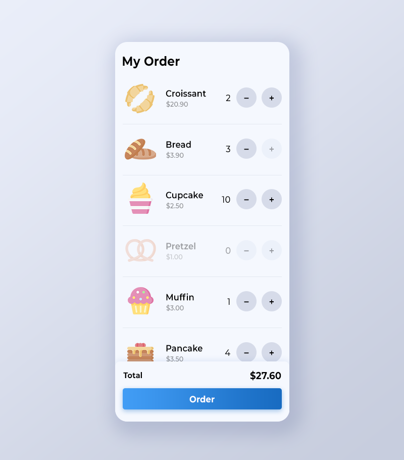

# 🧁 Bakery Order App

This is a React-based bakery ordering app that allows users to select items from a list of available products and submit an order. It mimics a simple point-of-sale or kiosk interface for a bakery or small shop.

---

## 🚀 Features

- Fetches a product list from a local server.
- Displays available bakery items dynamically.
- Lets users choose quantities for each item.
- Shows a running total of the order.
- Submits the final order via API.
- Handles loading states and error messages gracefully.

---

## 🛠️ Technologies Used

- React (Functional components, Hooks)
- JavaScript (ES6+)
- Axios for API calls
- Bootstrap (or your chosen CSS framework)
- Local Node.js server for backend API
- React Router (for navigation)
- React `useMemo`, `useCallback` for optimization

---

## 📸 Screenshots

### 🏠 Home Page



### ✅ Order Success Page


---

## 📦 Local Development

## API Reference

#### Get all items

```http
  GET /api/storage
```

- Returns an array `storage`
- Inside of `storage` are multiple objects with the following structure:

| Key | Type | Description |
| :-------- | :------- | :--- |
| `name` | `string` | Name of item |
| `stock` | `integer` | Number of items in stock |
| `price` | `number` | Price of item |

#### Post order

```http
  POST /api/order
```

- Expects an array `items`
- Inside of `items` one or multiple objects of the following structure are expected:

| Key | Type | Description |
| :--- | :--- | :--- |
| `name` | `string` | **Required**. name of item to order |
| `quantity` | `integer` | **Required**. quantity of item to order |

- the api will return status code 200 and `{message: 'success'}` if the order went through
- the api will return status code 400 and `{error: 'ERROR_MESSAGE', errorItem: 'ITEM_NAME'}` if the quantity is too high for a certain item

## Setup and run server
```
cd A1G-FE-challenge
npm i
npm run start
```

## Setup and run frontend
```
cd A1G-FE-challenge/client
npm i
npm run start
```


## Credits

Icons made by [Freepik](https://www.freepik.com)</a> from [https://www.flaticon.com/](www.flaticon.com)
